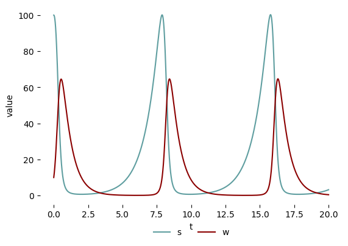

# The Subliminal Wolf

A Jupyter notebook exploring predator-prey dynamics through the lens of economic agency, using the Lotka-Volterra model.



## Setup

This repository is configured for running a Jupyter notebook in a virtual environment.

### Requirements
- Python 3.11
- Virtual environment tools

### Quick Start

1. Create and activate a virtual environment:
   ```bash
   python -m venv venv

   # On Windows:
   venv\Scripts\activate
   # On macOS/Linux:
   source venv/bin/activate
   ```

2. Install requirements:
   ```bash
   pip install -r requirements.txt
   ```

3. Launch Jupyter notebook:
   ```bash
   jupyter notebook
   ```

-or-

1. Use any Jupyter notebook containers you are already comfortable with.

## About

This notebook explores the relationship between economic agency and predator-prey dynamics, using wolves and sheep as metaphors for economic actors. The model is derived from the classic Lotka-Volterra equations, with modifications to explore behavioral economics concepts.

The notebook herein is derived from a notebook-based course material by J. M. Applegate of Arizona State University.

For academic references and detailed discussion of the model's derivation, please see the references section within the notebook itself.
